# 🍕 PIZZA SALES ANALYSIS

### PROJECT DESCRIPTION

This project explores pizza sales data to uncover business insights such as sales trends, top-performing pizza types, and customer ordering patterns.
It combines SQL for data querying and Power BI for visualization, transforming raw transactional data into a dynamic and interactive report.

Although it began as a guided project, I expanded it by writing and refining my own SQL queries; additional logic, structure, and design were implemented, including a custom Insight Panel, Control Icons for easy navigation, and a more refined reporting flow.

### PROJECT OBJECTIVES

1. Compute key performance indicators (KPIs) such as Total Revenue, Total Orders, Total Pizzas Sold, Average Order Value, and Avg Pizza per Order.
   
2. Identify top and bottom performing pizzas by revenue, quantity, and order frequency.

3.  sales across categories, sizes, time periods, and days of the week.

4. Derive actionable insights for operational and marketing decisions.

5. Visualize all findings in an interactive Power BI dashboard.

   

### 🧰 TOOLS

1. **SQL Server Management Studio (SSMS)** – Data querying and calculations.

2. **Power BI Desktop** – Visualization and dashboard development.

### 🗂️ DATASET INFORMATION 

- Source: Pizza Sales dataset (CSV)

- Records: 48,620 rows

- Fields:

_order_id_ – Unique order reference.

_order_date, order_time_ – Date and time of each transaction.

_pizza_id_ – Unique identifier for each pizza sold.

_pizza_name, pizza_category, pizza_size_ – Product details.

_quantity_ – Units ordered.

_total_price_ – Toal sales amount.

### 🧮 SQL ANALYSIS

---------

### **A. KEY PERFORMANCE METRICS**

#### **_1. Total Revenue:  $817,860_**

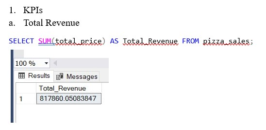

#### **_2. Average Order Value:  $38.32_**

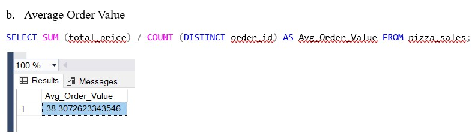

#### **_3. Total Pizzas Sold:  49,574_**

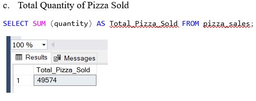

#### **_4. Total Orders:   21,350_**

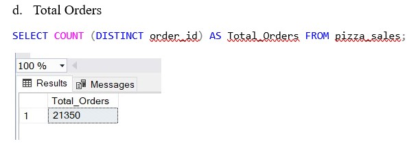

#### **_5. Average Pizzas per Order:  2.32_**

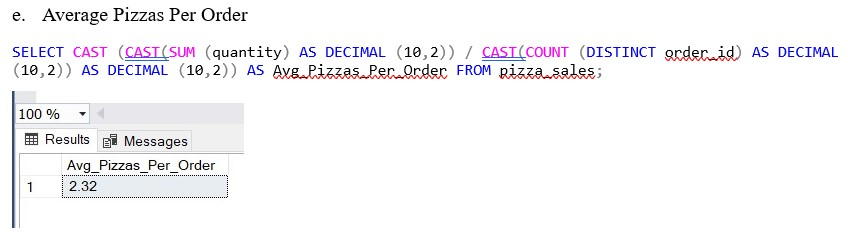

---

### **B. MONTHLY, DAILY, & HOURLY TREND METRICS**

Sales displayed a steady upward trend toward the weekend, with Thursday and Fridays recording the highest number of orders. Across the day, 12 PM marked the peak ordering hour, while July stood out as the month with the highest overall order volume.

#### **_1. Monthly Trend:_**

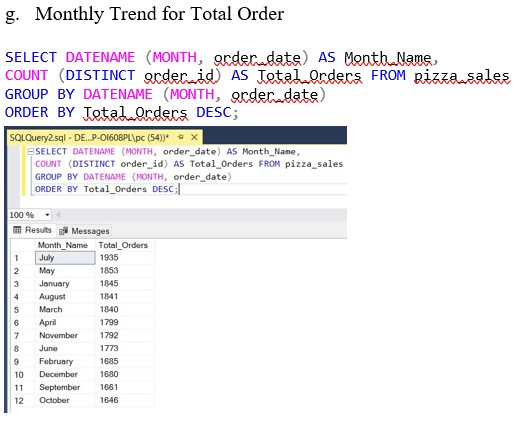

#### **_2. Daily Trend:_**

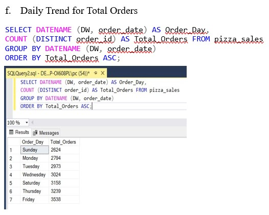

#### **_3. Hourly Trend:  12pm was the period of with the highest orders of 2520_**

---

### **C. PERCENTAGE SALES ACROSS PIZZA CATEGORY AND PIZZA SIZE METRICS**

Insight:

In terms of pizza category performance, Classic pizzas generated the highest share of total revenue at 26.91%, followed by Supreme at 25.46%, Chicken at 23.96%, and Veggie contributing the remaining 23.68%.

When analyzed by pizza size, Large pizzas dominated with 45.89% of total sales, while Medium sizes accounted for 30.39%, Small contributed 21.17%, and Extra Large and XXL sizes together made up 1.84% of total sales.

#### **_1. Percentage Sales by Pizza Category_**

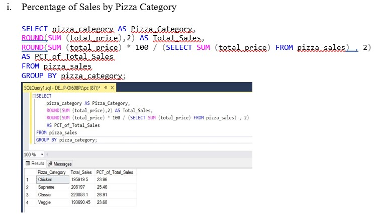

#### **_2. Percentage Sales by Pizza Size_**

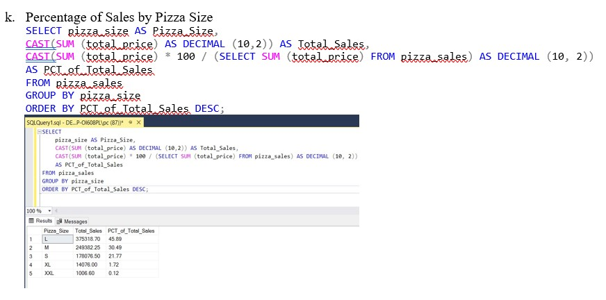

---

### **D. TOP & BOTTOM 5 SELLING PIZZAS METRICS**

Insight:

For revenue performance, the **Thai Chicken, Barbecue Chicken, California Chicken, Classic Deluxe, and Spicy Italian pizzas** ranked among the top sellers, while the **Brie Carre, Mediterranean, Spinach Pesto, Green Garden, and Spinach Supreme** pizzas recorded the lowest sales.

A similar pattern was observed in quantity sold and total orders, where the high-performing pizzas also attracted the most purchases, while the same low-revenue categories had the fewest orders. This consistency across metrics highlights clear customer preferences and stable product demand patterns.

#### **_1. TOP 5 SELLING PIZZA BY REVENUE_**

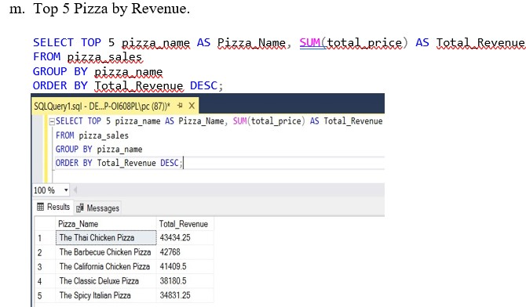

#### **_2. BOTTOM 5 SELLING PIZZA BY REVENUE_**

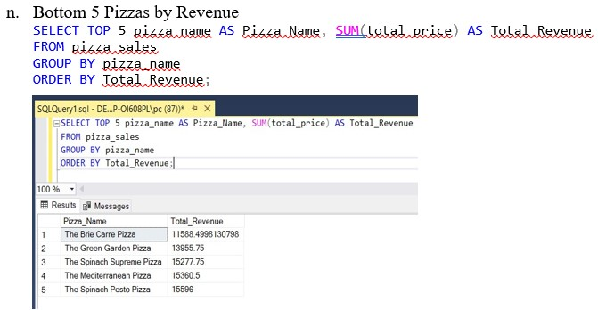

#### **_3. TOP 5 SELLING PIZZA BY QUANTITY SOLD_**

#### **_4. BOTTOM 5 SELLING PIZZA BY QUANTITY SOLD_**

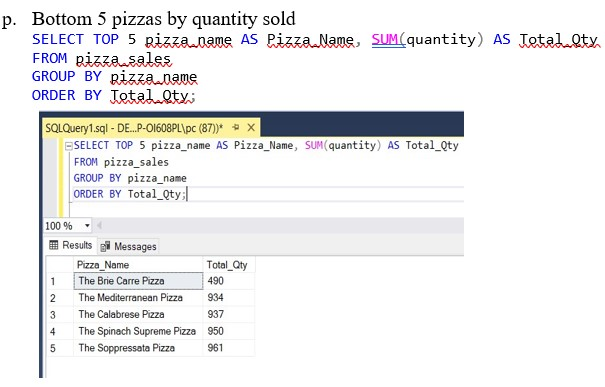

#### **_5. TOP 5 SELLING PIZZA BY TOTAL ORDERS_**

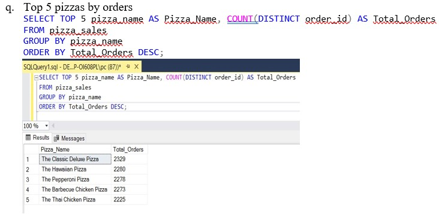

#### **_6. TOP 5 SELLING PIZZA BY TOTAL ORDERS_**

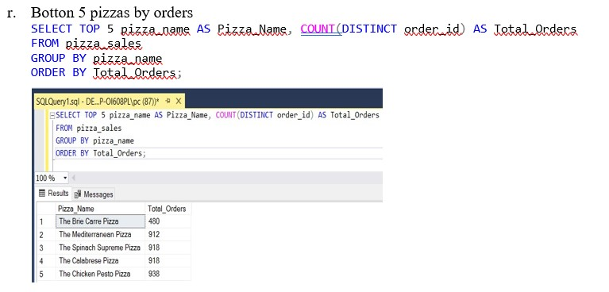

---

### 📊 POWER BI DASHBOARD

The interactive dashboard brings the analysis to life through clear, dynamic visuals. 

It features:

KPI cards displaying total revenue, total orders, and total pizzas sold.

Sales breakdowns by category and pizza size, showing which products drive the most value.

Hourly and daily order trends, revealing customer buying patterns across different times and days.

Top and bottom-selling pizzas, highlighting performance extremes for business insight.

A slicer-enabled Insight Panel, allowing users to filter data by date, pizza size, or category for deeper exploration.

**Click the image below to watch the full project walkthrough.**

[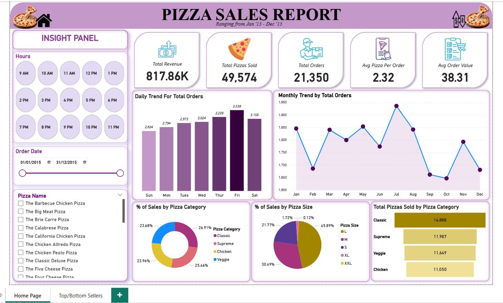](https://drive.google.com/file/d/1uYKUViDSk7K5I2RYBfhd750iUGRj5i-X/view?usp=sharing)

